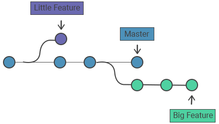

# cour 01 : Introduction 


## 1. **Introduction à Git :**

>Git est un système de gestion de version décentralisé, conçu pour suivre les modifications apportées aux fichiers au fil du temps, en particulier dans le contexte du développement logiciel. Il a été créé par Linus Torvalds en 2005 et est largement utilisé dans l'industrie du développement logiciel pour faciliter la collaboration entre les membres d'une équipe et la gestion efficace des versions du code source.

En tant que système de gestion de version, Git permet aux développeurs de travailler sur leurs propres copies locales d'un projet, d'apporter des modifications, de créer des branches pour développer de nouvelles fonctionnalités ou corriger des bugs, puis de fusionner ces branches de manière cohérente. 

Git maintient un historique complet des modifications, ce qui facilite la récupération d'anciennes versions du code, la détection de conflits potentiels et la collaboration entre les membres de l'équipe, même dans des environnements distribués.


Le principal avantage de Git réside dans sa capacité à gérer efficacement les modifications apportées à un projet, en enregistrant l'historique des modifications, en 
permettant la collaboration entre plusieurs développeurs et en facilitant le suivi des différentes versions du code.


## 2. **les  avantages de git :**

Git offre de nombreux avantages en tant que système de gestion de version distribué. Voici quelques-uns des points clés :

1. **Historique des changements avec horodatage :** 
    
    - Git enregistre chaque modification avec un horodatage ( la date et à l'heure associées à chaque commit), ce qui permet de suivre l'historique complet des changements dans le code source. Chaque *commit* est associé à un message descriptif qui aide à comprendre la nature des modifications.

    
    


2. **Résolution de conflits :** 
    
    - Lorsque plusieurs développeurs travaillent sur le même fichier et effectuent des modifications concurrentes, Git facilite la détection et la résolution des conflits. Les développeurs peuvent fusionner manuellement les modifications pour garantir la cohérence du code.


    

3. **Gestion puissante des branches :** 
    
    - Git permet la création facile de branches pour le développement de fonctionnalités, la correction de begues, ou toute autre tâche sans perturber le code principal. Ces branches peuvent être fusionnées de manière propre et efficace.


    

4. **Distribution et décentralisation :** 

    - Chaque utilisateur de Git dispose d'une copie locale complète du dépôt, ce qui permet de travailler de manière indépendante, même hors ligne. La décentralisation facilite également la collaboration entre les membres de l'équipe.


    


5. **Serveur central distant :** 
    
    - Bien que chaque développeur dispose d'une copie locale du dépôt, Git prend en charge un serveur central distant. Cela facilite la synchronisation des changements entre les membres de l'équipe et permet d'avoir une source de vérité commune.


6. **Efficacité de la gestion des versions :** 
    
    - Git utilise une structure de données intelligente qui rend la gestion des versions rapide et efficace. Les commits sont stockés de manière incrémentielle, ce qui permet d'économiser de l'espace disque et de faciliter les opérations de fusion.

7. **Suivi des auteurs et crédits :** 
    
    - Chaque modification est associée à un auteur, ce qui permet de suivre la contribution de chaque membre de l'équipe. Cela favorise la reconnaissance du travail individuel et facilite la communication au sein de l'équipe.

8. **Simplicité d'utilisation :** 
    
    - Git offre une interface en ligne de commande puissante, mais il existe également des interfaces graphiques conviviales pour ceux qui préfèrent une approche visuelle.


## 3. **Installation de Git sur Unix :**

Pour installer Git sur un système Unix, vous pouvez utiliser le gestionnaire de paquets spécifique à votre distribution. 

**Ubuntu/Debian :**

```bash
   sudo apt-get update
   sudo apt-get install git
```

Une fois l'installation terminée, vous pouvez vérifier si Git a été installé correctement en exécutant la commande suivante dans votre terminal :

```bash
   git --version
```

Cette commande devrait afficher la version de Git installée sur votre machine, conformant ainsi une installation réussie.


#### RQ :

La documentation officielle de Git est hébergée sur le site web git-scm.com. Vous pouvez accéder à la documentation Git officielle en suivant ce lien : [Documentation Git](https://git-scm.com/doc).

Sur le site, vous trouverez une documentation complète qui couvre tous les aspects de l'utilisation de Git, depuis les bases jusqu'aux fonctionnalités plus avancées. La documentation est généralement bien organisée et comprend des guides, des références de commandes, des tutoriels, et des informations détaillées sur les concepts fondamentaux de Git.


