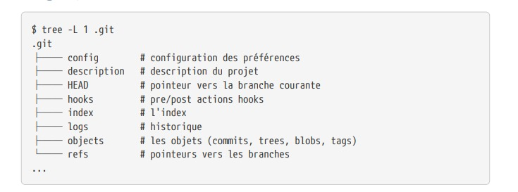
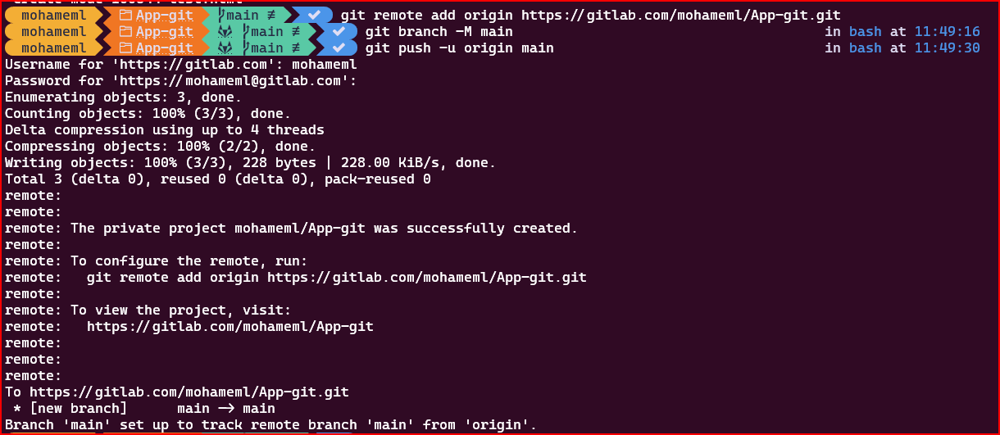
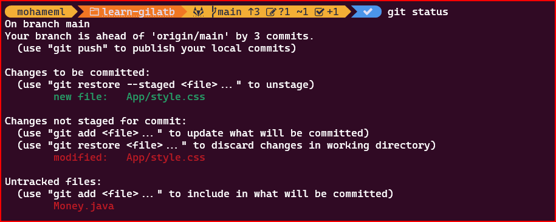

# cour 2 : **Premiers pas avec git**


## 1. **La commande `git help` est votre ami:**

La commande `git help` est utilisée pour obtenir de l'aide sur différentes commandes Git. Elle affiche des informations détaillées sur une commande spécifique ou fournit des informations générales sur les concepts Git. 

- **Aide Générale sur Git :**
   ```bash
   git help
   ```
   Cela affiche un résumé des commandes Git couramment utilisées et des sections d'aide générales.

2. **Aide pour une Commande Spécifique :**
   ```bash
   git help <nom_de_la_commande>
   ```
   Par exemple :
   ```bash
   git help commit
   ```
   Cela affiche des informations détaillées sur la commande spécifiée, dans cet exemple, "commit".

3. **Aide Abrégée pour une Commande :**
   ```bash
   git <nom_de_la_commande> --help
   ```
   Par exemple :
   ```bash
   git commit --help
   ```
   Cela affiche une aide abrégée pour la commande spécifiée.

4. **Aide pour un Sujet Spécifique :**
   ```bash
   git help <sujet>
   ```
   Par exemple :
   ```bash
   git help workflows
   ```
   Cela affiche des informations sur le sujet spécifié, dans cet exemple, "workflows".

>Notez que les deux premières méthodes (`git help` et `git help <commande>`) peuvent nécessiter une touche de défilement ou la touche "q" pour quitter l'affichage de l'aide.

Utiliser `git help` est un moyen pratique d'obtenir des informations détaillées sur les commandes Git et d'approfondir votre compréhension des concepts Git.


## 2. **Initialisation:**


L'initialisation d'un système de gestion de version pour un projet, en particulier avec Git, implique la création d'un dépôt Git pour suivre les modifications apportées à vos fichiers

### 2.1 **méthode init :``git init``**

avce la méthode **``git init``** :

1. **Création d'un Nouveau Projet :**
   - Créez un nouveau répertoire pour votre projet si vous n'en avez pas déjà un :
    ```bash
     mkdir nom_du_projet
     cd nom_du_projet
    ```

2. **Initialisation du Dépôt Git :**
   - Utilisez la commande `git init` pour initialiser un nouveau dépôt Git dans le répertoire du projet :
    ```bash
     git init
    ```
   - Cette commande crée un dossier caché appelé `.git` dans le répertoire du projet, qui contiendra toutes les informations de suivi des versions.

   

3. **Ajout de Fichiers au Suivi de Version :**
   - Utilisez la commande `git add` pour ajouter des fichiers au suivi de version. Par exemple, pour ajouter tous les fichiers du répertoire courant :
     ```bash
     git add .
     ```

4. **Réalisation du Premier Commit :**
   - Utilisez la commande `git commit` pour créer un commit initial avec les fichiers que vous avez ajoutés :
     ```bash
     git commit -m "Premier commit"
     ```
   - Vous devez ajouter un message descriptif avec l'option `-m` pour expliquer les modifications apportées dans ce commit.

5. **Configuration du Dépôt Distant:**
   - Si vous souhaitez sauvegarder votre dépôt sur une plateforme de stockage distant comme GitHub, GitLab ou Bitbucket : 
     ```bash
     git remote add origin https://gitlab.com/votre_nom_utilisateur/nom_du_projet.git
     git branch -M main
     git push -u origin main
     ```

Votre projet est maintenant sous versionnement avec Git, et vous pouvez continuer à ajouter, modifier et valider vos fichiers au fur et à mesure que votre projet évolue. 



### 2.2 **méthode clonage : ``git clone``**

La méthode de clonage est une excellente alternative pour initialiser un dépôt Git, surtout si vous travaillez avec un dépôt distant déjà existant. Voici comment vous pouvez créer un nouveau projet en utilisant la méthode de clonage :

1. **Clonage d'un Dépôt Existant :**
   - Si le projet que vous souhaitez versionner est déjà sur une plateforme de stockage comme GitHub, GitLab ou Bitbucket, vous pouvez cloner le dépôt existant. Utilisez la commande `git clone` :
     ```bash
     git clone https://github.com/utilisateur/nom_du_projet.git
     ```
   - Remplacez l'URL par celle de votre dépôt distant.

2. **Accès au Nouveau Répertoire :**
   - Accédez au répertoire du projet nouvellement cloné :
     ```bash
     cd nom_du_projet
     ```

3. **Travaillez avec le Dépôt Cloné :**
   - Vous pouvez désormais travailler avec le dépôt comme d'habitude. Ajoutez, modifiez, et validez vos fichiers en utilisant les commandes `git add` et `git commit`.

   Exemple :

    - ajouter le fichier ``test.html``
    ```bash
    git add test.html
    git commit -m "fichier test.html"
    git push 
    ```


En utilisant la méthode de clonage, vous pouvez rapidement démarrer avec un projet existant, obtenir une copie locale du dépôt, et commencer à travailler sur votre machine.


## 3. **Configuration:``git config``:**

La commande `git config` est utilisée pour configurer les paramètres de Git sur votre système. Elle peut être utilisée pour définir des options telles que votre nom d'utilisateur, votre adresse e-mail, les alias de commandes, et bien d'autres. Voici comment utiliser `git config` avec quelques exemples :

### 3.1 Configuration Globale (pour l'utilisateur actuel) :

1. **Configurer le Nom d'Utilisateur :**
   ```bash
   git config --global user.name "Votre Nom"
   ```

2. **Configurer l'Adresse E-mail :**
   ```bash
   git config --global user.email "votre@email.com"
   ```

3. **Configurer l'Éditeur de Texte par Défaut (par exemple, Vim) :**
   ```bash
   git config --global core.editor vim
   ```


4. **`git config --global color.ui`:** 
    
    - est utilisée pour activer ou désactiver la coloration syntaxique dans la sortie de la ligne de commande Git au niveau global (pour tous les dépôts sur votre machine). 
    
    - **Activer la Coloration Syntaxique Globalement :**
        ```bash
        git config --global color.ui true
        ```
   Cela active la coloration syntaxique pour tous les dépôts Git sur votre machine.


5. ``la liste de toutes les configurations:``
    
    ```bash
    git config --list
    ```
    Pour afficher la liste de toutes les configurations Git sur votre système.


    Si vous souhaitez filtrer les configurations pour un contexte spécifique (par exemple, uniquement les configurations globales), vous pouvez ajouter l'option `--global` comme suit :

    ```bash
    git config --global --list
    ```


### 3.2 Configuration Locale (pour un projet spécifique) :

1. **Configurer le Nom d'Utilisateur Localement (dans un projet spécifique) :**
   ```bash
   git config user.name "Votre Nom"
   ```

2. **Configurer l'Adresse E-mail Localement (dans un projet spécifique) :**
   ```bash
   git config user.email "votre@email.com"
   ```

3. **Afficher les Configurations :**

    - **Afficher Toutes les Configurations :**
    ```bash
    git config --list
    ```

    - **Afficher une Configuration Spécifique (par exemple, l'adresse e-mail) :**
    ```bash
    git config user.email
    ```

4. **Supprimer une Configuration :**

    - **Supprimer une Configuration Globale (par exemple, l'adresse e-mail) :**
    ```bash
    git config --global --unset user.email
    ```

    - **Supprimer une Configuration Locale (dans un projet spécifique) :**
    ```bash
    git config --unset user.email
    ```

## 4. **l'état actuel : `git status`**

>La commande `git status` est utilisée pour afficher l'état actuel du répertoire de travail en comparaison avec la zone de préparation (staging area) et le dernier commit. 
```bash
git status
```
La sortie de cette commande vous donnera des informations sur les modifications non suivies, les fichiers modifiés, les fichiers en attente d'être ajoutés (staged), les branches actuelles.

- **informations fournies par `git status` :**

1. **Changements non suivis (Untracked files)** : 
   
   - Listes des fichiers présents dans votre répertoire de travail mais qui ne sont pas encore ajoutés à la zone de préparation. Vous pouvez les ajouter avec `git add`.

2. **Changements modifiés mais non encore ajoutés (Changes not staged for commit)** : 
   
   - Liste des fichiers modifiés dans votre répertoire de travail mais qui n'ont pas encore été ajoutés à la zone de préparation. Vous pouvez les ajouter avec `git add`.

3. **Changements prêts à être commités (Changes to be committed)** : 
   - Liste des fichiers ajoutés à la zone de préparation et prêts à être inclus dans le prochain commit.

4. **La branche actuelle et son état** : 
   - Si vous êtes sur une branche particulière, `git status` vous indiquera sur quelle branche vous vous trouvez et si elle est en avance, en retard ou à jour par rapport à la branche distante (remote branch).



`git status` est une commande utile pour obtenir un aperçu rapide de l'état de votre répertoire de travail et pour suivre les modifications en cours. Elle peut vous aider à décider quels fichiers ajouter, commités, ou ignorer.


## 5. **Ajouter les modifications:``git add``**

La commande `git add` en Git est utilisée pour ajouter des modifications de fichiers au "staging area" (zone de préparation ou index), afin de les inclure dans le prochain commit. 

- **Ajouter Tous les Fichiers Modifiés à la Staging Area :**

    - Cette commande ajoute toutes les modifications et les nouveaux fichiers à la "staging area" dans le répertoire de travail courant et ses sous-répertoires. Cependant, elle n'ajoute pas les fichiers qui ont été supprimés.

    ```bash
    git add .
    ```


- **Ajouter un Fichier Spécifique à la Staging Area :**

    - Cela ajoute le fichier spécifié à la "staging area". Vous pouvez spécifier plusieurs fichiers en les séparant par des espaces.

    ```bash
    git add nom_du_fichier
    ```


- **Ajouter Tous les Fichiers Nouveaux et Modifiés Récursivement (Incluant les Sous-Dossiers) :**

    - Cette commande ajoute toutes les modifications, y compris les nouveaux fichiers, les fichiers modifiés et les fichiers supprimés, à la "staging area" de manière récursive dans tout le projet.

    ```bash
    git add -A
    ```

    ou

    ```bash
    git add --all
    ```


- **Ajouter des Modifications de Fichiers en Mode Interactif :**

    - Cette option lance le mode interactif, vous permettant de sélectionner les fichiers à ajouter à la "staging area" de manière interactive.

    ```bash
    git add -i
    ```

    ou

    ```bash
    git add --interactive
    ```


- **Ajouter des Changements dans Certains Fichiers en Mode Patch :**

    - **Mode Patch:`git add -p` ou `git add --patch`**
        
    
    - Le mode patch en Git permet une interaction plus fine lors de l'ajout de modifications à la *staging area*. Cela permet de sélectionner de manière interactive les parties spécifiques des modifications dans un fichier que vous souhaitez inclure dans le prochain commit.
        
    - C'est utile lorsque vous avez apporté plusieurs modifications à un fichier, mais que vous ne souhaitez valider qu'une partie spécifique de ces modifications.

        
    
    - Lorsque vous exécutez `git add -p`, Git vous présente chaque modification dans le fichier sous forme de *patch* (ou *hunk*) et vous demande si vous souhaitez l'ajouter à la *staging area*. 

    - Vous pouvez répondre avec des options comme :
        - `y` : Ajouter cette modification à la "staging area".
        - `n` : Ne pas ajouter cette modification.
        - `s` : Diviser cette modification en parties plus petites.
        - `q` : Quitter le mode patch.


## 6. **Enregistrer les modifications:``git commit``**


La commande `git commit` en Git est utilisée pour enregistrer les modifications actuellement présentes dans la "staging area" (zone de préparation ou index) dans le dépôt Git local sous la forme d'un nouveau commit. 


- **Commit Simple avec un Message :**

    - Cette commande crée un nouveau commit avec les modifications actuelles de la "staging area" et associe un message de commit qui décrit brièvement les modifications apportées.

    ```bash
    git commit -m "Message du commit"
    ```


- **Commit Multiligne:**

    - Si vous n'incluez pas l'option `-m`, Git ouvrira un éditeur de texte par défaut (tel que Vim ou Nano) pour que vous puissiez saisir un message de commit multiligne.


    ```bash
    git commit
    ```


- **Amender le Dernier Commit avec de Nouvelles Modifications :**
    
    -  **L'amendement du dernier commit:** en Git permet de modifier ou d'ajouter des modifications au commit le plus récent
    
    - Cette option permet d'ajouter de nouvelles modifications à l'ancien commit. Elle combine les modifications de la "staging area" avec le dernier commit.

    ```bash
    git add new_file
    git commit --amend
    ```
    puis Git ouvrira l'éditeur de texte par défaut (Vim, Nano, etc.) pour que vous puissiez modifier le message du dernier commit.


- **L'option -a :**
    
    - pour  Commiter tous les fichiers modifiés sans utiliser `git add` .

    - L'option `-a` (ou `--all`) permet de commiter tous les fichiers modifiés sans utiliser préalablement `git add`. Cela ne fonctionne pas pour les nouveaux fichiers.

    ```bash
    git commit -a -m "Message du commit"
    ```


## 7. **Pousser les modifications:``git push``**

La commande `git push` en Git est utilisée pour pousser les modifications locales vers un dépôt distant. Elle sert à mettre à jour le dépôt distant avec les derniers commits de votre branche locale. 

- **Pusher sur la branche par défaut:**
   
   -  La commande git push tout court est utilisée pour pousser les modifications locales vers le dépôt distant. Voici comment elle est généralement utilisée :

   ```bash
   git push
   ```

   Lorsque vous utilisez cette commande sans spécifier de branche, Git tentera de pousser la branche locale courante vers la branche correspondante sur le dépôt distant configuré par défaut .


- **Pusher sur une Branche Spécifique :**

   - Cette commande pousse les commits de la branche spécifiée vers le dépôt distant (par exemple, `origin` est souvent utilisé pour désigner le dépôt distant par défaut).

    ```bash
    git push origin nom_de_la_branche
    ```


- **Forcer le Push (Attention à l'Utilisation) :**
   
   - Utiliser `--force` ou `-f` force le push même si cela entraîne un rejet non lié à une mise à jour rapide. Cependant, soyez prudent avec cette option car elle peut entraîner la perte d'historique et perturber le travail des autres collaborateurs.

   ```bash
   git push --force origin nom_de_la_branche
   ```

   ou

   ```bash
   git push -f origin nom_de_la_branche
   ```


