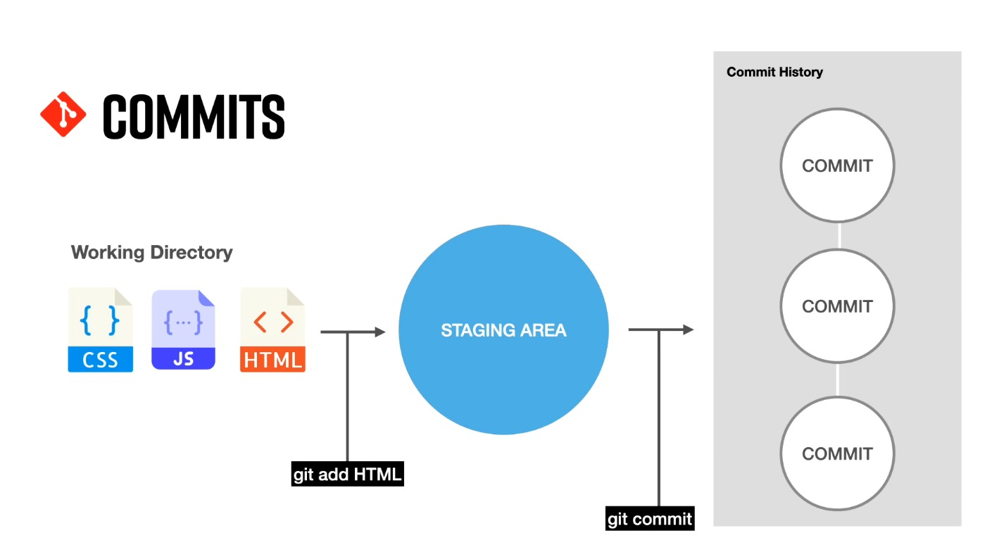
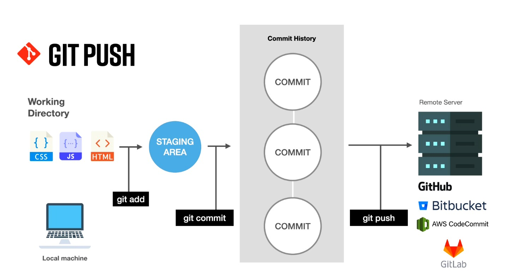

# cour 03 : **How git Works ?** 

## 1. L’espace de travail git :

Pour comprendre le fonctionnement de Git, il est essentiel de comprendre ces trois concepts principaux : le Working Directory (Répertoire de Travail), la Staging Area (Zone de Préparation ou Index), et le Local Repository (Dépôt Local). Ajoutons également le concept de Dépôt Distant pour une vue plus complète :

1. **Working Directory (Répertoire de Travail) :**
   - Le Working Directory est simplement le répertoire sur votre système de fichiers où vous travaillez avec vos fichiers. C'est là que vous créez, modifiez et supprimez des fichiers. Lorsque vous initialisez un nouveau dépôt Git, le contenu de ce répertoire est considéré comme non suivi par Git.

2. **Staging Area (Zone de Préparation ou Index) :**
   - La Staging Area est une zone intermédiaire entre le Working Directory et le Local Repository. Avant qu'un fichier ne soit enregistré dans l'historique du dépôt (commit), il doit être ajouté à la Staging Area. Cela vous permet de sélectionner spécifiquement les modifications que vous souhaitez inclure dans le prochain commit. Vous utilisez la commande `git add` pour déplacer des modifications du Working Directory vers la Staging Area.
   
3. **Local Repository (Dépôt Local) :**
   - Le Local Repository est la base de données Git locale qui stocke l'historique complet des commits et des changements. Lorsque vous effectuez un commit avec `git commit`, les modifications dans la Staging Area sont enregistrées dans le Local Repository. Cela crée une capture instantanée de l'état de votre projet à ce moment-là. Vous pouvez revenir à n'importe quel point dans l'historique à l'aide de commits.





4. **Dépôt Distant :**
   - Le Dépôt Distant est un serveur distant où vous pouvez stocker et partager votre projet Git avec d'autres collaborateurs. Les dépôts distants sont utiles pour la collaboration, la sauvegarde et le déploiement. GitHub, GitLab et Bitbucket sont des exemples de plateformes de dépôts distants populaires. Vous pouvez cloner un dépôt distant sur votre machine locale pour travailler sur le projet, puis pousser vos modifications vers le dépôt distant avec `git push`.





En résumé, le cycle de travail typique avec Git consiste à modifier les fichiers dans le Working Directory, à les ajouter à la Staging Area pour sélectionner les modifications à inclure dans le prochain commit, à effectuer un commit pour enregistrer ces modifications dans le Local Repository, puis à pousser ces commits vers un Dépôt Distant pour la collaboration et le partage avec d'autres. Ces concepts clés sont au cœur du modèle de versionnement décentralisé de Git.


## 2. **tracked** et **untracked**

>En Git, les termes "tracked" et "untracked" font référence à l'état des fichiers par rapport au système de contrôle de version. 


1. **Tracked (suivi) :**
   - Un fichier est considéré comme *tracked* s'il est sous le contrôle de version de Git. Cela signifie que Git est conscient des modifications apportées à ce fichier et suit son historique.
   - Un fichier peut être *tracked* s'il a été ajouté à la zone de préparation (staging area) et a été inclus dans un commit précédent.

2. **Untracked (non suivi) :**
   - Un fichier est considéré comme *untracked* s'il n'est pas sous le contrôle de version de Git. Git ne suit pas les modifications de ce fichier, et il n'a pas été inclus dans un commit précédent.
   - Les fichiers *untracked* sont généralement des fichiers nouvellement créés dans le répertoire de travail.

**Exemples :**

- Si vous créez un nouveau fichier dans votre répertoire de travail, ce fichier sera initiallement considéré comme *untracked*.
  
  ```bash
  touch nouveau_fichier.txt
  ```

- Si vous ajoutez ce fichier à la zone de préparation avec `git add`, il devient *tracked* et sera inclus dans le prochain commit.

  ```bash
  git add nouveau_fichier.txt
  ```

- Si vous supprimez un fichier suivi (`tracked`), il devient *untracked* et Git ne le suivra plus.

  ```bash
  git rm fichier_suivi.txt
  ```


## 3. **Le fichier `.gitignore`:**

- **Description :**

>Le fichier `.gitignore` est utilisé dans un projet Git pour spécifier les fichiers et répertoires qui ne doivent pas être suivis par Git. Ces fichiers et répertoires ne seront pas inclus dans les commits et ne seront pas pris en compte par les opérations Git telles que `git status` ou `git add`.

- **Utilisation:**

1. **Création du fichier `.gitignore` :** Vous créez un fichier nommé `.gitignore` à **la racine de votre répertoire de travail Git**.

2. **Spécification des fichiers à ignorer :** Vous ajoutez des motifs de fichiers ou de répertoires que vous souhaitez ignorer dans le fichier `.gitignore`. Chaque motif est spécifié sur une ligne distincte.

   Exemple de contenu du fichier `.gitignore` :

   ```plaintext
   # Ignorer les fichiers de sauvegarde
   *.bak

   # Ignorer les fichiers journaux
   logs/

   # Ignorer les fichiers de configuration spécifiques à l'utilisateur
   config/user-settings.txt
   ```

3. **Enregistrement du fichier `.gitignore` :** Vous ajoutez et committez le fichier `.gitignore` au référentiel Git.

   ```bash
   git add .gitignore
   git commit -m "Ajout du fichier .gitignore"
   ```

4. **Effet sur le suivi des fichiers :** Les fichiers et répertoires spécifiés dans `.gitignore` ne seront pas suivis par Git.

Le fichier `.gitignore` est utile pour exclure des fichiers générés automatiquement, des fichiers de configuration locaux, des fichiers temporaires, des fichiers de compilation, etc. Cela permet de maintenir un historique Git propre et de ne pas encombrer le référentiel avec des fichiers qui ne sont pas pertinents pour le partage du code source.

