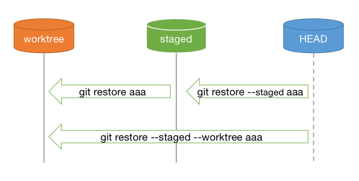

# cour 03 : **Revenir en arrière** 

## 1. **la commande ``git checkout <commit>``:**

- **Description:**

>La commande `git checkout <commit>` est utilisée pour déplacer la branche HEAD vers un commit spécifique dans Git. Cela signifie que vous allez passer à un état dans lequel votre répertoire de travail reflète l'état du commit spécifié.

- **La syntaxe générale est la suivante :**

```bash
git checkout <commit>
```

Remplacez `<commit>` par le numéro de hachage SHA-1 du commit vers lequel vous souhaitez vous déplacer, ou par une référence de branche, une étiquette, ou toute autre référence à un commit.

- **état détaché** (``detached HEAD state``) 

Il est important de noter que cette commande place votre référence ``HEAD`` dans un **état détaché** (``detached HEAD state``) si vous spécifiez un commit au lieu d'une branche. 
Dans cet état, les nouveaux commits ne seront pas associés à une branche existante, ce qui signifie que vous ne pouvez pas les pousser directement vers une branche.

Si vous souhaitez créer une nouvelle branche basée sur le commit spécifié, vous pouvez utiliser la commande `git switch -c <new-branch-name>` après avoir exécuté la commande `git checkout <commit>`. Cela créera une nouvelle branche à partir du commit spécifié et vous placera dessus.

- **Rétour:**

Après avoir utilisé `git checkout <commit>` pour vous déplacer vers un commit spécifique , vous pouvez revenir à une branche spécifique en utilisant `git checkout <nom_branche>`.


```bash
# Revenir à une branche spécifique après être allé sur un commit spécifique
git checkout <nom_branche>
```

Remplacez `<nom_branche>` par le nom de la branche vers laquelle vous souhaitez retourner. 

Cette commande déplacera votre HEAD sur la branche spécifiée et vous ramènera à l'état normal, où les nouveaux commits seront ajoutés à la branche.


- **récupérer un fichier spécifique:**

La commande `git checkout` peut être utilisée pour récupérer un fichier spécifique à partir d'un commit particulier. Voici la syntaxe générale :

```bash
git checkout <commit>  <fichier>
```

- `<commit>` : L'identifiant du commit à partir duquel vous souhaitez récupérer le fichier.
- `<fichier>` : Le chemin du fichier que vous souhaitez récupérer.

Par exemple, si vous voulez récupérer le fichier "monFichier.txt" à partir du commit avec l'identifiant "abcd123", vous pouvez utiliser la commande suivante :

```bash
git checkout abcd123  monFichier.txt
```

Cette commande remplacera le contenu actuel du fichier "monFichier.txt" dans votre répertoire de travail par la version présente dans le commit "abcd123"et l'ajoute à la zone de préparation (staging area) . 


## 2. **La commande `git reset`:**

- **Description:**

>La commande `git reset` est utilisée pour déplacer la branche HEAD vers un commit spécifique et peut également être utilisée pour modifier l'état du répertoire de travail et de la zone de préparation. Voici quelques-unes des options les plus couramment utilisées avec `git reset` :

- **les options:**

1. **`git reset <commit>` :commit -> workdirc**
   
   - Déplace la branche HEAD et la zone de préparation (staging area) vers le commit spécifié  en conservant les modifications dans le répertoire de travail.

   ```bash
   git reset <commit>
   ```

2. **`git reset --soft <commit>` :commit -> staging area**
   - Déplace la branche HEAD vers le commit spécifié tout en conservant les modifications dans la zone de préparation et le répertoire de travail.
   ```bash
   git reset --soft <commit>
   ```

3. **`git reset --mixed <commit>` (par défaut) :commit -> workdirc**
   - Déplace la branche HEAD vers le commit spécifié et réinitialise la zone de préparation (staging area) pour correspondre au commit, mais conserve les modifications dans le répertoire de travail.
   ```bash
   git reset --mixed <commit>
   ```

4. **`git reset --hard <commit>` :annuler tout**
   - Déplace la branche HEAD vers le commit spécifié et réinitialise la zone de préparation et le répertoire de travail pour correspondre exactement au commit (attention : toutes les modifications non commitées seront perdues).
   ```bash
   git reset --hard <commit>
   ```

5. **`git reset HEAD <file>` : staging area -> workdirc**
   - Annule les changements du fichier spécifié dans la zone de préparation sans toucher au répertoire de travail.
   ```bash
   git reset HEAD <file>
   ```

6. **`git reset --merge` :**
   - Annule un commit de fusion. Cette option est utilisée pour annuler le dernier commit de fusion et réinitialiser l'index et le répertoire de travail au commit précédent.
   ```bash
   git reset --merge
   ```

7. **`git reset --hard HEAD~1` :annuler tout**
   - Annule le dernier commit et réinitialise la zone de préparation et le répertoire de travail.
   ```bash
   git reset --hard HEAD~1
   ```

8. **`git reset --keep <commit>` :**
   - Déplace la branche HEAD vers le commit spécifié, mais préserve les modifications non liées aux commits dans le répertoire de travail.
   ```bash
   git reset --keep <commit>
   ```


## 3. **La commande `git restore`:**


- **Description:**

>La commande `git restore` a été introduite dans Git 2.23 et est principalement utilisée pour restaurer les modifications dans le répertoire de travail en fonction du dernier commit. Elle peut également être utilisée pour manipuler les modifications dans la zone de préparation.

- **les options:**


1. **`git restore <file>`:**
    
    - La commande `git restore <file>` est utilisée pour annuler les modifications non stagées (non ajoutées à la zone de préparation) dans un fichier spécifique et restaurer le fichier à son état dans le dernier commit.


  ```bash
  git restore <file>
  ```


2. **``git restore --staged <file>``:**

    - Si vous souhaitez également annuler les modifications qui ont été ajoutées à la zone de préparation et les ramener dans le répertoire de travail, vous pouvez utiliser l'option `--staged` :

    ```bash
    git restore --staged <file>
    ```

3. **l'option ``--source``:**

  L'option `--source` avec la commande `git restore` permet de spécifier la source à partir de laquelle les modifications doivent être restaurées dans un fichier spécifique. Cette option est utile lorsque vous souhaitez restaurer les modifications à partir d'un commit spécifique.

  - **La syntaxe générale est la suivante :**

    ```bash
    git restore --source=<commit> <file>
    ```

    - `<commit>` : Spécifie le commit à partir duquel restaurer les modifications.
    - `<file>` : Le fichier spécifique pour lequel vous souhaitez restaurer les modifications.

  - **Exemple:**
  
    Par exemple, pour restaurer les modifications d'un fichier spécifique à partir d'un commit particulier, vous pouvez utiliser la commande suivante :

    ```bash
    git restore --source=abcd123 <file>
    ```

    Cela restaurera les modifications du fichier `<file>` telles qu'elles étaient dans le commit avec l'identifiant `abcd123`. Vous pouvez remplacer `abcd123` par le véritable identifiant du commit que vous souhaitez utiliser comme source.

4. **l'option ``--worktree``:**

   - Cette option permet de  restaurer les modifications d' un fichier spécifié ( `<fichier>` ) à partir du commit spécifié (`<commit>`) directement dans le répertoire de travail, sans toucher à la zone de préparation (staging area).
   
   ```bash
   git restore --source=<commit> --worktree <fichier>
   ```




#### RQ :  Différences principales entre La commande `git restore` et la commande `git reset`

La commande `git restore` et la commande `git reset` sont toutes deux utilisées pour manipuler l'état des fichiers dans votre répertoire de travail et votre zone de préparation (staging area), mais elles diffèrent dans leur fonctionnement et dans les situations auxquelles elles sont adaptées.

- `git restore` est principalement utilisé pour travailler dans le répertoire de travail et la zone de préparation sans changer l'historique des commits. Il offre une syntaxe plus expressive pour manipuler les modifications.

- `git reset` est plus puissant et peut être utilisé pour déplacer la branche HEAD vers un commit spécifique, modifiant ainsi l'historique des commits. Cela peut également être utilisé pour manipuler la zone de préparation et le répertoire de travail.

En général, `git restore` est plus sûr pour manipuler le répertoire de travail, tandis que `git reset` est utilisé lorsque vous avez besoin de modifier l'historique des commits ou de réinitialiser complètement l'état de votre répertoire de travail. 


## 4. **La commande `git revert`:**  

- **Description:** 

   >La commande `git revert` est utilisée pour créer un nouveau commit qui annule les modifications d'un commit précédent, tout en conservant l'historique du projet. Contrairement à `git reset`, qui modifie l'historique en supprimant des commits, `git revert` crée un nouveau commit qui représente l'inverse des modifications du commit spécifié.


- **La syntaxe générale de la commande est la suivante :**

   ```bash
   git revert <commit>
   ```

   - `<commit>` : L'identifiant du commit que vous souhaitez annuler.

   Lorsque vous exécutez cette commande, Git créera un nouveau commit qui annule les modifications introduites par le commit spécifié. Vous pouvez également spécifier plusieurs commits à annuler en une seule fois.


