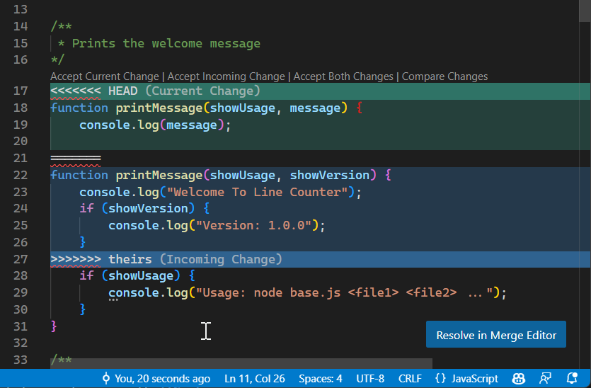

# cour 06 : Branches 


## 1. introduction :

- **Definition:**

>une branche est une référence mobile qui pointe vers un commit spécifique dans l'historique du projet. Elle représente une ligne de développement indépendante, permettant aux utilisateurs de travailler sur différentes fonctionnalités, correctifs de bogues ou tâches simultanément sans affecter la version principale du code. 


- Chaque branche peut avoir son propre historique de commits.

- Une branche est comme une ligne parallèle d'évolution dans le projet, isolée des autres branches. Les commits effectués sur une branche n'affectent pas les autres branches jusqu'à ce qu'une opération de fusion soit réalisée. Cela permet une gestion souple et efficace du développement, en permettant aux équipes de travailler sur des fonctionnalités distinctes sans interférer les unes avec les autres.

- La branche par défaut dans Git s'appelle généralement "master" (ou "main" dans certaines configurations). Lorsqu'un dépôt est initialisé, une première branche est créée, et c'est sur cette branche que les modifications sont généralement apportées. Cependant, de nouvelles branches peuvent être créées à partir de la branche principale pour travailler sur des fonctionnalités spécifiques.


## 2. Manipulation des braches :

Ces opérations de base sont essentielles pour travailler avec des branches dans Git. 
 
**1. Créer une branche :**

  - Pour créer une nouvelle branche en Git, vous pouvez utiliser la commande `git branch`. 

    ```bash
    git branch <nom_branche>
    ```

  - Exemple :
    si vous voulez créer une branche appelée "ma_nouvelle_branche", vous exécuterez la commande suivante :

    ```bash
    git branch ma_nouvelle_branche
    ```


**2. Basculer entre les branches :**

   - **Commande :** `git checkout <nom_branche>`
   - **Description :** Permet de basculer d'une branche à une autre. Le HEAD est déplacé vers la branche spécifiée.

   - **Commande (version Git 2.23 et ultérieure) :** `git switch <nom_branche>`
   - **Description :** Effectue la même opération que `git checkout`.

**3. Créer et basculer vers une nouvelle branche en une seule commande :``l'option -b , -c``**

   - **Commande :** `git checkout -b <nom_nouvelle_branche>`
   - **Description :** Crée une nouvelle branche et bascule directement vers celle-ci.

   - **Commande (version Git 2.23 et ultérieure) :** `git switch -c <nom_nouvelle_branche>`
   - **Description :** Effectue la même opération que `git checkout -b`.

**4. Liste des branches :**

   - **Commande :** `git branch`
   - **Description :** Affiche la liste des branches locales. La branche active est marquée avec un astérisque.


**5. Supprimer une branche :**

   - **Commande :** `git branch -d <nom_branche>`
   - **Description :** Supprime une branche après la fusion. Utiliser `-D` pour forcer la suppression, même si des modifications n'ont pas été fusionnées.


## 3. **fusion des branches :**

### 3.1 **Definition:**

>**La fusion** des branches en Git est le processus qui consiste à combiner les modifications provenant de deux branches distinctes dans un seul historique de code. L'objectif est d'incorporer les changements d'une branche dans une autre, généralement pour intégrer de nouvelles fonctionnalités, correctifs de bugs ou modifications apportées dans une branche de développement vers la branche principale ou une autre branche.

En d'autres termes, la fusion permet de réunir l'historique de deux branches distinctes en un nouvel historique qui intègre toutes les modifications apportées dans les deux branches. Cette opération peut être réalisée de manière automatique lorsque les branches n'ont pas divergé ou nécessiter une intervention manuelle pour résoudre les conflits lorsque les modifications ont été apportées aux mêmes parties des fichiers dans les deux branches.


### 3.2 **types de fusion :**

Il existe principalement deux types de fusion des branches dans Git : la fusion **Fast-Forward** et la fusion **avec commit** de fusion.

1. **Fusion Fast-Forward :**

- **Description :**

   La fusion Fast-Forward se produit lorsque la branche que vous souhaitez fusionner n'a pas eu de nouveaux commits depuis le moment où votre branche actuelle a été créée à partir de cette branche. Cela signifie que votre branche actuelle est simplement en avance par rapport à la branche que vous souhaitez fusionner.


- **commande:**
   Vous pouvez effectuer une fusion Fast-Forward avec la commande suivante :

   ```bash
   git checkout branche_destination
   git merge --ff-only votre_branche
   ```

   Cela dit à Git d'effectuer la fusion Fast-Forward uniquement si cela est possible sans créer de nouveaux commits de fusion. Si la fusion Fast-Forward n'est pas possible (par exemple, si la branche que vous souhaitez fusionner a eu des nouveaux commits), Git affichera un message d'erreur et vous devrez utiliser la fusion standard avec commit de fusion.


2. **Fusion avec Commit de Fusion :**

- **Description:**

   La fusion avec commit intervient lorsqu'il y a eu des modifications sur les deux branches que vous fusionnez. Cela crée un nouveau commit qui fusionne les changements des deux branches, et ce commit a deux parents, pointant vers les derniers commits de chaque branche. 
   
- **Exemple:**

Imaginez deux branches qui ont divergé :

```
       A---B---C (branche_destination)
            \
             D---E (votre_branche)
```

Lorsque vous fusionnez `votre_branche` dans `branche_destination`, Git crée un nouveau commit de fusion (par exemple, commit F) :

```
       A---B---C---F (branche_destination)
            \       /
             D---E (votre_branche)
```

Le commit de fusion ``F`` a deux parents, ``C`` et ``E``, indiquant que les deux branches ont été intégrées dans ce nouveau commit.

- **commande:**

   - Pour effectuer une fusion avec commit, vous pouvez utiliser la commande suivante :

      ```bash
      git checkout branche_destination
      git merge votre_branche
      ```

   Git ouvrira un éditeur de texte pour saisir le message de fusion. 

   - Si vous souhaitez faire une fusion avec commit sans éditer le message, vous pouvez utiliser l'option `-m` pour spécifier le message directement :

      ```bash
      git merge votre_branche -m "Message de fusion"
      ```

#### RQ : 

>N'oubliez pas que si des modifications ont été apportées aux mêmes parties des fichiers dans les deux branches, cela peut entraîner des conflits, et vous devrez les résoudre manuellement avant de finaliser la fusion.


### 3.3 les options de ``git merge :``


La commande `git merge` en Git permet de fusionner les modifications de deux branches. 

1. **`--no-ff` (No Fast-Forward) :**
   - **Description :** Force la création d'un commit de fusion, même si la fusion pourrait être réalisée en mode Fast-Forward.
   - **Exemple :**
     ```bash
     git merge --no-ff branche_source
     ```

2. **`--ff-only` (Fast-Forward Only) :**
   - **Description :** Permet uniquement une fusion en mode Fast-Forward. Si cela n'est pas possible, la commande échouera.
   - **Exemple :**
     ```bash
     git merge --ff-only branche_source
     ```

3. **`--squash` :**
   - **Description :** Comprime tous les commits de la branche source en un seul commit avant de les fusionner. Utile pour regrouper plusieurs commits en un seul.
   - **Exemple :**
     ```bash
     git merge --squash branche_source
     ```

4. **`--abort` :**
   - **Description :** Annule la fusion en cours et restaure l'état avant la fusion (pratique : en cas de conflits).
   - **Exemple :**
     ```bash
     git merge --abort
     ```

5. **`-m` (Message) :**
   - **Description :** Permet de spécifier un message de fusion directement en ligne de commande.
   - **Exemple :**
     ```bash
     git merge branche_source -m "Message de fusion personnalisé"
     ```

6. **`--strategy` :**
   - **Description :** Spécifie la stratégie de fusion à utiliser. Par exemple, `recursive` est la stratégie par défaut.
   - **Exemple :**
     ```bash
     git merge --strategy=recursive branche_source
     ```

7. **`--strategy-option` :**
   - **Description :** Permet de passer des options spécifiques à la stratégie de fusion.
   - **Exemple :**
     ```bash
     git merge --strategy-option=theirs branche_source
     ```

8. **`--no-commit` :**
   - **Description :** Effectue la fusion, mais ne crée pas automatiquement de commit. Cela laisse les modifications en mode de préparation pour que vous puissiez ajuster et valider manuellement.
   - **Exemple :**
     ```bash
     git merge --no-commit branche_source
     ```


## 4. **Résolution des conflits :**

### 4.1 **conflits:**

- >Un conflit en Git se produit lorsque deux branches concurrentes ont apporté des modifications au même fichier, aux mêmes lignes de code, et que Git ne peut pas automatiquement fusionner ces modifications en raison de divergences. En d'autres termes, Git ne sait pas comment combiner les changements de manière automatique car ils sont contradictoires ou incompatibles.

- Les conflits surviennent généralement lors d'une opération de fusion (`git merge`) ou de rébase (`git rebase`). Ils nécessitent une intervention manuelle pour résoudre les différences entre les branches et permettre à Git de finaliser la fusion.

- **Exemple:**

Voici comment un conflit peut se manifester dans un fichier :

1. **Dans le fichier d'origine (par exemple, `fichier.txt`) :**
   ```plaintext
   Ligne 1 : Cette ligne est dans la branche A.
   Ligne 2 : Cette ligne est dans la branche A.
   Ligne 3 : Cette ligne est dans la branche A.
   ```

2. **Dans la branche B, des modifications sont apportées :**
   ```plaintext
   Ligne 1 : Cette ligne est dans la branche B.
   Ligne 2 : Cette ligne est dans la branche B.
   Ligne 3 : Cette ligne est dans la branche B.
   ```

Lors de la tentative de fusion ou de rébase, Git ne peut pas décider automatiquement quelles modifications conserver car les deux branches ont modifié les mêmes lignes du fichier. Cela entraîne un conflit.


### 4.2 **L'affichage d'un conflit:**

L'affichage typique d'un conflit dans un fichier lors d'une opération de fusion avec Git, notamment dans l'éditeur de texte Visual Studio Code, ressemble à ceci :

```plaintext
<<<<<<< HEAD
Contenu de la branche courante (HEAD)
=======
Contenu de la branche à fusionner
>>>>>>> branche_source
```



Explication de chaque partie :

- `<<<<<<< HEAD` : Marque le début de la section de conflit provenant de la branche actuelle (HEAD).
- Contenu de la branche courante (HEAD) : Les modifications effectuées dans la branche actuelle jusqu'à la tentative de fusion.
- `=======` : Marque la séparation entre les deux versions en conflit.
- Contenu de la branche à fusionner : Les modifications effectuées dans la branche que vous essayez de fusionner dans la branche actuelle.
- `>>>>>>> branche_source` : Marque la fin de la section de conflit provenant de la branche à fusionner (remplacez "branche_source" par le nom de votre branche source).

Ces marqueurs `<<<<<<<`, `=======`, et `>>>>>>>` indiquent clairement les sections en conflit. Vous devrez choisir manuellement quelles modifications conserver en supprimant les marqueurs et en ajustant le contenu du fichier.

Lorsque vous résolvez le conflit, le fichier doit être modifié pour refléter la version résolue, et ensuite vous pouvez marquer le conflit comme résolu avec `git add fichier_en_conflit`. Cela permettra à Git de finaliser la fusion ou la rébase.


### 4.3  **Résolution des conflits :**

Pour résoudre un conflit, vous devrez examiner manuellement le fichier en conflit, décider des modifications à conserver, et ensuite indiquer à Git que le conflit a été résolu. Vous pouvez résoudre un conflit en suivant ces étapes générales :

1. **Ouvrir le Fichier en Conflit :** Le fichier en conflit sera marqué dans Git. Ouvrez-le dans un éditeur de texte.

2. **Identifier et Résoudre les Conflits :** Repérez les sections en conflit dans le fichier et choisissez quelles modifications conserver. Modifiez le fichier en conséquence.

3. **Marquer le Conflit comme Résolu :** Une fois les modifications effectuées, marquez le conflit comme résolu en utilisant la commande :
   ```bash
   git add fichier_en_conflit
   ```

4. **Finaliser la Fusion ou la Rébase :** Continuez la fusion (`git merge --continue`) ou la rébase (`git rebase --continue`) pour finaliser l'opération.

Cela permet à Git de comprendre que vous avez résolu le conflit et de continuer le processus de fusion ou de rébase.


### 5. **Bonnes pratiques pour éviter les conflits :**

1. **Mettre à jour régulièrement :**
   - Avant de commencer à travailler sur une fonctionnalité, assurez-vous que votre branche est à jour avec la branche principale pour éviter les conflits majeurs.

   ```bash
   git pull origin ma_branche_principale
   ```

2. **Diviser le travail :**
   - Divisez les fonctionnalités en tâches plus petites et travaillez sur des branches dédiées. Cela réduit les chances de conflits et facilite la fusion.

3. **Utiliser des branches de fonctionnalité :**
   - Créez des branches distinctes pour chaque fonctionnalité ou correctif. Cela permet une gestion propre et facilite les fusions.

   ```bash
   git checkout -b fonctionnalite_x
   ```

4. **Fusion fréquente :**
   - Fusionnez régulièrement la branche principale dans votre branche de fonctionnalité pour éviter de gros conflits.

   ```bash
   git merge ma_branche_principale
   ```

5. **Comprendre les modifications :**
   - Comprenez les modifications apportées par les autres membres de l'équipe pour anticiper les conflits potentiels.

6. **Tester avant de fusionner :**
   - Testez vos modifications avant de les fusionner pour minimiser les erreurs et conflits.

7. **Utiliser des outils de résolution de conflits :**
   - Utilisez des outils Git tels que `git mergetool` pour faciliter la résolution des conflits.

En suivant ces bonnes pratiques, vous pouvez minimiser les conflits et faciliter le processus de fusion dans vos projets Git.
 


