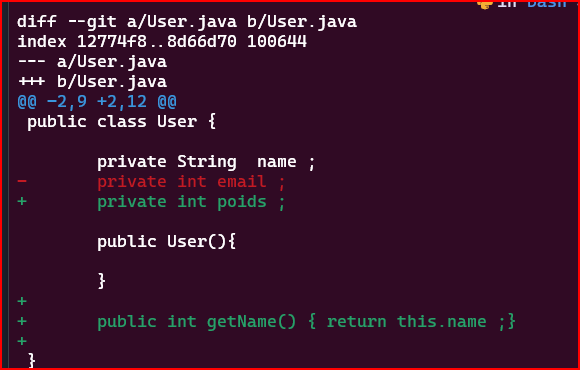

## 2. **`git diff`**


- **Description:**
  
  La commande ``git diff`` est utilisée dans Git pour afficher les différences entre deux états de votre référentiel Git

- **les options:**

1. **Différences entre la "Staging Area" et le Répertoire de Travail :**
   - Cette commande affiche les modifications qui n'ont pas encore été ajoutées à la **staging area**.
   ```bash
   git diff
   ```

2. **Différences entre Deux Commits :**
   - Pour afficher les différences entre deux commits spécifiques, utilisez les identifiants SHA des commits.
   ```bash
   git diff SHA_COMMIT1 SHA_COMMIT2
   ```

3. **Différences dans un Fichier Spécifique :**
   - Pour afficher les modifications dans un fichier spécifique entre la "staging area" et le répertoire de travail, utilisez :
   ```bash
   git diff nom_du_fichier
   ```

   Exemple :

   

4. **Différences dans un Dossier Spécifique :**
   - Pour afficher les modifications dans un dossier spécifique entre la "staging area" et le répertoire de travail :
   ```bash
   git diff chemin_du_dossier
   ```

5. **Différences entre le Dernier Commit et la "Staging Area" :**
   - Pour afficher les modifications dans la **staging area** par rapport au dernier commit :
   ```bash
   git diff --staged
   ```

6. **Différences avec un Commit Spécifique :**
   - Pour afficher les modifications entre la "staging area" et un commit spécifique :
   ```bash
   git diff --staged SHA_DU_COMMIT
   ```

7. **Différences Ignorant les Espaces (Whitespace) :**
   - Pour afficher les différences en ignorant les changements d'espacement :
   ```bash
   git diff --ignore-space-change
   ```

8. **Différences en Mode "Word" :**
   - Pour afficher les différences en mode "word" :
   ```bash
   git diff --word-diff
   ```
   - L'option ``--word-diff`` dans la commande git diff est utilisée pour afficher les différences au niveau des mots plutôt qu'au niveau des lignes entières.